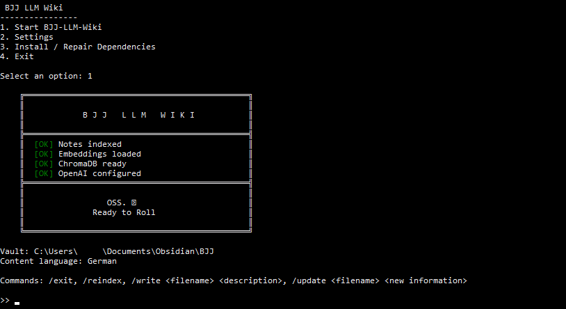

# BJJ LLM Wiki

A terminal-based tool for building and querying a personal Brazilian Jiu-Jitsu knowledge base using structured Markdown notes, Obsidian, LLM-assisted note generation, and Retrieval-Augmented Generation (RAG).



## Goal

The project is designed to turn personal BJJ knowledge into a structured and searchable wiki without replacing that knowledge with generic LLM-generated technique instructions.

- Use Markdown notes as the source of truth
- Use Obsidian as a visual frontend for browsing and editing the wiki
- Let an LLM structure personal BJJ knowledge into consistent note schemas
- Connect related positions and techniques through `[[Wiki-Links]]`
- Ask questions about the wiki using RAG
- Keep the underlying knowledge base portable and independent of the application

---

## How It Works

The BJJ LLM Wiki combines structured note generation with hybrid retrieval.

```text
                         ┌─────────────────────┐
                         │     User Input      │
                         └──────────┬──────────┘
                                    │
                  ┌─────────────────┴─────────────────┐
                  │                                   │
             /write /update                       Question
                  │                                   │
                  ▼                                   ▼
        ┌───────────────────┐               ┌───────────────────┐
        │ Schema + Rules    │               │ Hybrid Retrieval  │
        │ + Canonical Notes │               │ Chroma + Titles   │
        └─────────┬─────────┘               └─────────┬─────────┘
                  │                                   │
                  ▼                                   ▼
        ┌───────────────────┐               ┌───────────────────┐
        │    LLM Writer     │               │   Grounded LLM    │
        └─────────┬─────────┘               └───────────────────┘
                  │
                  ▼
        ┌───────────────────┐
        │ Markdown / Vault  │
        └─────────┬─────────┘
                  │
                  ▼
        ┌───────────────────┐
        │     Obsidian      │
        └───────────────────┘
```

### Core Components

- **Markdown Notes** — the knowledge base and source of truth
- **Obsidian** — visual frontend for browsing, editing, Wiki-Links, and Graph View
- **OpenAI API** — technique classification, structured note generation, updates, and question answering
- **ChromaDB** — vector database for semantic retrieval
- **Hybrid Retrieval** — combines semantic search with normalized title matching
- **Schemas** — define the structure of different BJJ note types
- **Global Writing Rules** — control terminology, linking behavior, structure, and how user-provided knowledge is handled

---

## Obsidian as the Frontend

This project is designed to work together with [Obsidian](https://obsidian.md/), which acts as the visual frontend for the knowledge base.

The BJJ LLM Wiki creates, updates, retrieves, and reasons over the Markdown data, while Obsidian provides the visual layer for:

- browsing and manually editing notes
- following `[[Wiki-Links]]`
- navigating related techniques
- exploring relationships through Graph View

Obsidian must be installed separately and is not included with this project.

The Markdown files remain the source of truth. The vault can therefore still be viewed, edited, moved, or used directly in Obsidian without running the LLM application.

---

## Features

- Terminal-based interaction
- Guided first-time setup
- Structured note generation for multiple BJJ entity types
- Schema-based note updates
- Global terminology and Wiki-Linking rules
- Canonical entity awareness using existing note titles
- Configurable descriptive content language
- Configurable writer and classifier models
- Hybrid RAG retrieval using semantic and lexical matching
- Markdown/Obsidian as a portable source of truth
- Writer benchmark suite with deterministic regression checks
- Preview and confirmation before generated notes are saved

---

## Setup

### Requirements

Before starting, you need:

- **Python 3**
- an **OpenAI API key**
- **Obsidian**
- an **Obsidian vault** where the BJJ notes should be stored

The launcher handles configuration and can install the required Python packages.

### 1. Clone the repository

```bash
git clone https://github.com/Leonard-B212/llm-bjj-wiki.git
cd llm-bjj-wiki
```

### 2. Start the launcher

```bash
python start.py
```

On the first start, the launcher detects that no `.env` configuration exists and starts the setup automatically.

You will be asked for:

```text
First-time setup
----------------
OpenAI API key:
Obsidian vault path:
Content language [English]:
```

The API key is stored locally in `.env` and is not committed to the repository.

The configured vault path must point to an existing Obsidian vault.

`LANGUAGE` controls descriptive note content. Schema headings, BJJ terminology, filenames, and Wiki-Link targets remain in English.

### 3. Dependencies

The launcher checks whether the required Python packages are installed.

If dependencies are missing, it can install them from `requirements.txt` using the same Python installation that started the launcher.

Dependencies can also be repaired or reinstalled later through the launcher menu.

### 4. Start the Wiki

After setup, the launcher displays:

```text
🥋 BJJ LLM Wiki
----------------

1. Start BJJ-LLM-Wiki
2. Settings
3. Install / Repair Dependencies
4. Exit
```

When you exit the Wiki with `/exit`, you return to the launcher.

---

## Commands

| Command | Description |
|---|---|
| `<free text>` | Ask a question about your notes using RAG |
| `/write <filename> <description>` | Create a structured note from user-provided BJJ knowledge |
| `/update <filename> <new information>` | Merge new information into an existing note while preserving its structure |
| `/reindex` | Rebuild the vector index after manual changes to the vault |
| `/exit` | Exit the Wiki and return to the launcher |

Example:

```text
>> /write Rear-Naked-Choke Classic choke from back control. Wrap the arm around the neck, secure the grip and bring the elbows together.
```

The generated note is shown as a preview before saving and must be confirmed by the user.

---

## Note Generation

The writer currently supports the following note types:

```text
submission
escape
sweep
pass
position
takedown
throw
```

Each type has its own schema in `app/schemas/`.

When `/write` is executed:

1. The input is classified into one of the supported note types.
2. The corresponding schema is loaded.
3. Global writing and Wiki-Linking rules are loaded.
4. Existing note titles are provided as canonical wiki entities.
5. The writer structures the user's BJJ knowledge according to the schema.
6. The generated Markdown is shown as a preview.
7. After confirmation, the note is written to the configured Obsidian vault.

### User Input as the Source of Truth

The writer is intended to **structure personal BJJ knowledge rather than generate a complete technique from general model knowledge**.

The user's description is therefore treated as the source of truth.

The writer may reorganize, clarify, and concisely rephrase the supplied information, but missing technical information should not intentionally be filled using general BJJ knowledge.

If a required schema section has no corresponding information in the user's input, the section remains present and is represented by:

```markdown
* TBD
```

This allows incomplete notes to remain structurally consistent without pretending that missing information was provided by the user.

### Wiki Links and Canonical Entities

BJJ entities can be connected using Obsidian Wiki-Links:

```markdown
[[Side-Control]]
[[Mount]]
[[Butterfly-Guard]]
[[Armbar]]
```

Existing note titles are supplied to the writer as canonical entities so that references can reuse the existing wiki terminology.

For example, perspective descriptions such as "top Side Control" or "bottom Side Control" refer to the same canonical position:

```markdown
[[Side-Control]]
```

Links to meaningful BJJ entities may also exist before the corresponding note has been created. This allows relationships between techniques to develop naturally as the wiki grows.

Generic mechanics and controls such as Underhooks, Crossfaces, Frames, Hooks, or Grips are normally kept as regular text rather than automatically becoming wiki entities.

---

## Note Updates

`/update` works against an existing Markdown note.

The current note is loaded together with the new information, and the LLM merges the new knowledge into the appropriate schema sections while preserving existing content and structure.

This makes it possible to gradually expand a technique note as new details are learned or tested.

---

## Retrieval

Questions are answered using hybrid retrieval.

### Semantic Search

ChromaDB embeddings are used to find notes that are semantically related to the question.

### Lexical Title Matching

Normalized note titles are also matched directly against the question.

Matching is case- and hyphen-insensitive, allowing a note such as:

```text
Side-Control.md
```

to be found from a query containing:

```text
side control
```

even if its embedding is weak.

The two approaches complement each other. Semantic search finds conceptually related content, while title matching prevents short or sparsely written notes from being missed simply because they have weak embeddings.

---

## Writer Benchmark

The repository contains a small benchmark suite for testing note generation against real BJJ input cases.

```text
benchmarks/
└── writer/
    ├── cases/
    ├── results/
    ├── model_pricing.py
    └── run_writer_benchmark.py
```

The benchmark can compare multiple writer models using the same inputs.

Each case can define deterministic expectations such as:

```json
{
  "must_contain": [
    "[[Side-Control]]",
    "[[Armbar]]"
  ],
  "must_not_contain": [
    "[[Top-Side-Control]]",
    "[[Bottom-Side-Control]]",
    "[[Underhook]]"
  ]
}
```

Besides regression checks, benchmark runs record information such as token usage, execution time, and estimated API cost.

The benchmark is intended to catch repeatable structural and Wiki-Linking errors rather than replace manual evaluation of BJJ content quality.

---

## Configuration

Configuration is stored locally in `.env`.

Example:

```text
OPENAI_API_KEY=your_api_key_here
VAULT_PATH=C:\Users\YourName\Documents\Obsidian\BJJ
LANGUAGE=English
WRITER_MODEL=gpt-5.6-luna
CLASSIFIER_MODEL=gpt-4.1-mini
```

Normally, configuration can be managed through the launcher instead of editing `.env` manually.

`.env` is excluded through `.gitignore`.

`.env.example` is included as a template for manual configuration.

Note folders are mapped by technique type through `TYPE_TO_FOLDER` in `app/config.py`. A new note type requires a folder mapping and a corresponding schema in `app/schemas/`.

---

## Run Without the Launcher

For normal use:

```bash
python start.py
```

For development, the application can also be started directly:

```bash
python -m app.main
```

Direct startup bypasses the launcher's setup, configuration validation, and dependency checks.

---

## Project Structure

```text
LLM-BJJ-Wiki/
│
├── app/
│   ├── main.py
│   ├── config.py
│   │
│   ├── cli/
│   │   ├── command_handler.py
│   │   └── diff_printer.py
│   │
│   ├── ingestion/
│   │   └── loader.py
│   │
│   ├── schemas/
│   │   ├── escape_schema.md
│   │   ├── global_rules.md
│   │   ├── pass_schema.md
│   │   ├── position_schema.md
│   │   ├── submission_schema.md
│   │   ├── sweep_schema.md
│   │   ├── takedown_schema.md
│   │   └── throw_schema.md
│   │
│   ├── services/
│   │   ├── note_update_service.py
│   │   ├── note_writer_service.py
│   │   └── rag_service.py
│   │
│   └── vectorstore/
│       ├── chroma_store.py
│       └── retrieval.py
│
├── assets/
│   └── bjj-llm-wiki-cli.png
│
├── benchmarks/
│   └── writer/
│       ├── cases/
│       ├── results/
│       ├── model_pricing.py
│       └── run_writer_benchmark.py
│
├── .env.example
├── .gitignore
├── LICENSE
├── requirements.txt
├── start.py
├── todo.md
└── README.md
```

The current structure is intentionally lightweight and may evolve as additional application and infrastructure boundaries are introduced.

---

## Current Status

Currently implemented:

- Terminal-based BJJ wiki
- Guided setup and configuration
- Seven schema-based BJJ note types
- Structured note creation and updating
- Global writing and Wiki-Linking rules
- Canonical note awareness
- Configurable content language
- Configurable LLM models
- ChromaDB vector storage
- Hybrid semantic + lexical retrieval
- Writer regression benchmark

Planned improvements include architecture cleanup, smarter routing, fuzzy note matching, duplicate detection, undo support, additional LLM providers, wiki linting, and deriving a knowledge graph from Markdown relationships.

See `todo.md` for the current roadmap.

---

## Notes

- OpenAI API usage may incur costs.
- The OpenAI API key is stored locally in `.env`.
- Markdown notes remain in the configured vault and are not part of this repository.
- Do not store sensitive information in notes that will be sent to an external LLM provider.
- This is currently a personal and learning project rather than a production system.

---

## License

This project is licensed under the MIT License. See the `LICENSE` file for details.